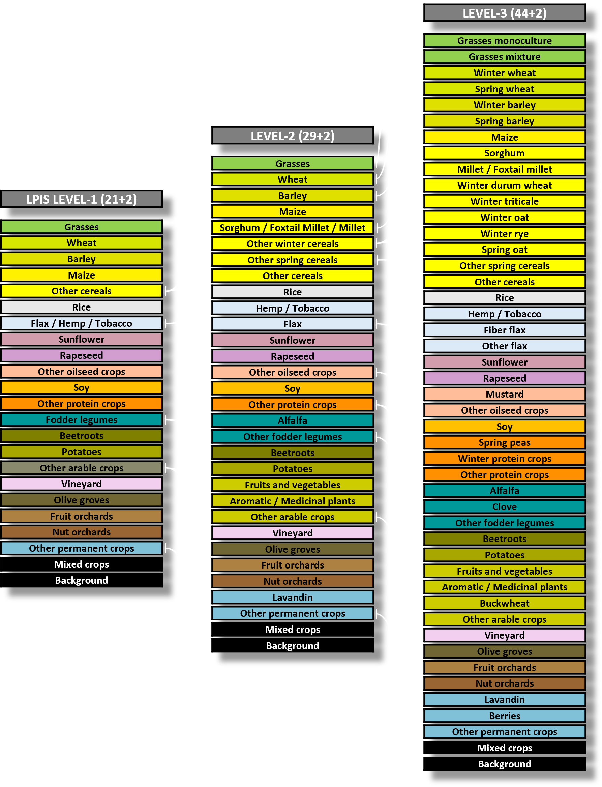

<div style="position: relative; text-align: center;">
  <a href="./flairhub_fr.html" style="font-size: 11pt;"><b>🇫🇷 Version française</b></a><br>
  
</div>
<br>


<center>
  
### 🌍 Overview


<table style="width:100%; max-width:400px; border: 2px solid green; border-radius: 12px; background-color: rgb(214, 212, 212); border-collapse: separate; border-spacing: 0;">
  <tbody style="color: #1e1e1e; font-size: 1.05em;">
    <tr><td style="border: none; padding: 4px 25px;">→&nbsp;🔗&nbsp;<a href="#LINKS" style="color: blue;"><b>Links</b></a></td></tr>
    <tr><td style="border: none; padding: 4px 25px;">→&nbsp;🎯&nbsp;<a href="#FIGURES" style="color: blue;"><b>Key Figures</b></a></td></tr>
    <tr><td style="border: none; padding: 4px 25px;">→&nbsp;🗂️&nbsp;<a href="#MODALITIES" style="color: blue;"><b>Modalities</b></a></td></tr>
    <tr><td style="border: none; padding: 4px 25px;">→&nbsp;🏷️&nbsp;<a href="#SUPERVISION" style="color: blue;"><b>Supervision</b></a></td></tr>
    <tr><td style="border: none; padding: 4px 25px;">→&nbsp;🧱&nbsp;<a href="#ARCHI" style="color: blue;"><b>Baseline Architecture</b></a></td></tr>
    <tr><td style="border: none; padding: 4px 25px;">→&nbsp;🧭&nbsp;<a href="#FLAIRs" style="color: blue;"><b>FLAIR challenges recap</b></a></td></tr>    
  </tbody>
</table>

</center>

<hr>


<center>
<table style="width:100%; max-width:1400px; border-collapse: separate; border-spacing: 0;">
  <thead>
    <tr>
      <th colspan="3" style="
        text-align: center;
        padding: 2% 15%;
        border: none;
        background-color: transparent;
        color: inherit;
        font-weight: bold;
      ">
        FLAIR-HUB builds upon and includes the FLAIR#1 and FLAIR#2 datasets, expanding them into a unified, large-scale, multi-sensor land-cover resource with very-high-resolution annotations. Spanning over 2,500 km² of diverse French ecoclimates and landscapes, it features 63 billion hand-annotated pixels across 19 land-cover and 23 crop type classes.<br><br>
        The dataset integrates complementary data sources including aerial imagery, SPOT and Sentinel satellites, surface models, and historical aerial photos, offering rich spatial, spectral, and temporal diversity. FLAIR-HUB supports the development of semantic segmentation, multimodal fusion, and self-supervised learning methods, and will continue to grow with new modalities and annotations.
      </th>
    </tr>
  </thead>
</table>
</center>


<p align="center"></p>


<hr><br><a id="LINKS"></a>

### 🔗 Links

<center>
<table style="width:100%; max-width:700px; background-color:rgb(61, 60, 60); border: 2px solid green; border-radius: 12px; border-collapse: separate; border-spacing: 0;">
  <tbody style="color: white; font-size: 1.05em;">
    <tr><td style="border: none; padding: 4px 20px;">📄 <a href="https://arxiv.org/pdf/2211.12979.pdf" target="_blank" style="color: lightgreen;">Data Paper</a> – Learn more about the dataset in the official publication</td></tr>
    <tr><td style="border: none; padding: 4px 20px;">📁 <a href="https://huggingface.co/datasets/IGNF/FLAIR-HUB" target="_blank" style="color: lightgreen;">Download Toy Dataset</a> – Includes all modalities in lightweight form</td></tr>
    <tr><td style="border: none; padding: 4px 20px;">📁 <a href="https://huggingface.co/datasets/IGNF/FLAIR-HUB" target="_blank" style="color: lightgreen;">Download Full Dataset</a> – Access the complete FLAIR-HUB data on HuggingFace</td></tr>
    <tr><td style="border: none; padding: 4px 20px;">🤖 <a href="https://huggingface.co/datasets/IGNF/FLAIR-HUB" target="_blank" style="color: lightgreen;">Pretrained Models</a> – Models trained on FLAIR-HUB</td></tr>
    <tr><td style="border: none; padding: 4px 20px;">💻 <a href="https://github.com/IGNF/FLAIR-HUB" target="_blank" style="color: lightgreen;">Source Code (GitHub)</a> – Explore training, preprocessing, and benchmark scripts</td></tr>
    <tr><td style="border: none; padding: 4px 20px;">✉️ <a href="mailto:flair@ign.fr" style="color: lightgreen;">Contact Us</a> – flair@ign.fr – Questions or collaboration inquiries welcome!</td></tr>
  </tbody>
</table>
</center>

<br><hr>


### 📚 How to Cite

If you use FLAIR-HUB in your research, please cite:

```
Anatol Garioud, Sébastien Giordano, Nicolas David, Nicolas Gonthier. 
FLAIR-HUB: semantic segmentation and domain adaptation dataset. (2025). 
DOI: https://doi.org/10.13140/RG.2.2.30183.73128/1
```

```bibtex
@article{ign2025flairhub,
  doi = {10.13140/RG.2.2.30183.73128/1},
  url = {https://arxiv.org/pdf/2211.12979.pdf},
  author = {Garioud, Anatol and Giordano, Sébastien and David, Nicolas and Gonthier, Nicolas},
  title = {FLAIR #1: semantic segmentation and domain adaptation dataset},
  publisher = {arXiv},
  year = {2025}
}
```


<br><hr><br><a id="FIGURES"></a>

### 🎯 Key Figures of the FLAIR-HUB Dataset

<br>

<center>
<table style="width:95%;max-width:600px;">

  <tbody>
    <tr><td>🗺️</td><td>ROI / Area Covered</td><td style="text-align: center">2,822 ROIs / 2,528 km²</td></tr>
    <tr><td>🏛️</td><td>Departments (France)</td><td style="text-align: center">74</td></tr>
    <tr><td>🧩</td><td>AI Patches (512×512 px)</td><td style="text-align: center">241,100</td></tr>
    <tr><td>🖼️</td><td>Annotated Pixels</td><td style="text-align: center">63.2 billion</td></tr>
    <tr><td>🛰️</td><td>Sentinel-2 Acquisitions</td><td style="text-align: center">256,221</td></tr>
    <tr><td>📡</td><td>Sentinel-1 Acquisitions</td><td style="text-align: center">532,696</td></tr>
    <tr><td>📁</td><td>Total Files</td><td style="text-align: center">~2.5 million</td></tr>
    <tr><td>💾</td><td>Total Dataset Size</td><td style="text-align: center">~750 GB</td></tr>
  </tbody>
</table>
</center>


<br><hr><br><a id="MODALITIES"></a>

### 🗂️ Data Modalities Overview

<br>

<center>
<table style="width:95%;max-width:600px;">
  <thead>
    <tr>
      <th>Modality</th>
      <th>Description</th>
      <th style="text-align: center">Resolution / Format</th>
      <th style="text-align: center">Metadata</th>
    </tr>
  </thead>
  <tbody>
    <tr>
      <td><strong>BD ORTHO (AERIAL_RGBI)</strong></td>
      <td>Orthorectified aerial images with 4 bands (R, G, B, NIR).</td>
      <td style="text-align: center">20 cm, 8-bit unsigned</td>
      <td style="text-align: center">Radiometric stats, acquisition dates/cameras</td>
    </tr>
    <tr>
      <td><strong>BD ORTHO HISTORIQUE (AERIAL-RLT_PAN)</strong></td>
      <td>Historical panchromatic aerial images (1947–1965), resampled.</td>
      <td style="text-align: center">~40 cm, real: 0.4–1.2 m, 8-bit</td>
      <td style="text-align: center">Dates, original image references</td>
    </tr>
    <tr>
      <td><strong>ELEVATION (DEM_ELEV)</strong></td>
      <td>Elevation data with DSM (surface) and DTM (terrain) channels.</td>
      <td style="text-align: center">DSM: 20 cm, DTM: 1 m, Float32</td>
      <td style="text-align: center">Object heights via DSM–DTM difference</td>
    </tr>
    <tr>
      <td><strong>SPOT (SPOT_RGBI)</strong></td>
      <td>SPOT 6-7 satellite images, 4 bands, calibrated reflectance.</td>
      <td style="text-align: center">1.6 m (resampled)</td>
      <td style="text-align: center">Acquisition dates, radiometric stats</td>
    </tr>
    <tr>
      <td><strong>SENTINEL-2 (SENTINEL2_TS)</strong></td>
      <td>Annual time series with 10 spectral bands, calibrated reflectance.</td>
      <td style="text-align: center">10.24 m (resampled)</td>
      <td style="text-align: center">Dates, radiometric stats, cloud/snow masks</td>
    </tr>
    <tr>
      <td><strong>SENTINEL-1 ASC/DESC (SENTINEL1-XXX_TS)</strong></td>
      <td>Radar time series (VV, VH), SAR backscatter (σ0).</td>
      <td style="text-align: center">10.24 m (resampled)</td>
      <td style="text-align: center">Stats per ascending/descending series</td>
    </tr>
    <tr>
      <td><strong>LABELS CoSIA (AERIAL_LABEL-COSIA)</strong></td>
      <td>Land cover labels from aerial RGBI photo-interpretation.</td>
      <td style="text-align: center">20 cm, 15–19 classes</td>
      <td style="text-align: center">Aligned with BD ORTHO, patch statistics</td>
    </tr>
    <tr>
      <td><strong>LABELS LPIS (ALL_LABEL-LPIS)</strong></td>
      <td>Crop type data from CAP declarations, hierarchical class structure.</td>
      <td style="text-align: center">20 cm</td>
      <td style="text-align: center">Aligned with BD ORTHO, may differ from CoSIA</td>
    </tr>
  </tbody>
</table>
</center>


<br><p align="center"></p>


<br><hr><br><a id="SUPERVISION"></a>

### 🏷️ Supervision 

FLAIR-HUB includes two complementary supervision sources: AERIAL_LABEL-COSIA, a high-resolution land cover annotation derived from expert photo-interpretation of RGBI imagery, offering pixel-level precision across 19 classes; and AERIAL_LABEL-LPIS, a crop-type annotation based on farmer-declared parcels from the European Common Agricultural Policy, structured into a three-level taxonomy of up to 46 crop classes. While COSIA reflects actual land cover, LPIS captures declared land use, and the two differ in purpose, precision, and spatial alignment.

<center>
<table style="width:100%; max-width:1100px;">
  <tr>
    <td><br><small>Land-cover supervision</small></td>
    <td><br><small>Crop-type supervision</small></td>
  </tr>
</table>
</center>


<br><hr><br><a id="ARCHI"></a>

### 🧱 Baselines architecture 

The baseline model, FLAIR-UPerFuse, is a modular architecture designed for multi-modal and multi-temporal remote sensing segmentation. It integrates spatial features via a Swin Transformer, temporal dynamics through a UTAE encoder, and combines them using a dedicated fusion module. A UPerNet decoder processes the fused features to generate segmentation outputs. The architecture dynamically adapts to the input configuration—handling mono- or multi-temporal data—and includes auxiliary branches to improve supervision and modality-specific learning. Training is guided by a composite loss function that balances main and auxiliary objectives across tasks and modalities.


<br><p align="center"></p><br>


<hr><br><a id="FLAIRs"></a>

### 🧭 Previous FLAIR challenges


FLAIR#1 introduced the first large-scale challenge for land cover mapping using high-resolution aerial imagery (20 cm) and expert semantic annotations across 812 km² of diverse French landscapes. It provided over 77,000 patches labeled into 19 land cover classes (13 used for training) and focused on domain adaptation, with testing done on entirely unseen regions and acquisition dates. The dataset and challenge highlighted the difficulty of building generalizable models under strong spatial and temporal shifts. Baselines relied on U-Net architectures and established a benchmark for cross-domain semantic segmentation in remote sensing.

🔗 FLAIR#1 code repo : https://github.com/IGNF/FLAIR-1 <br>
🔗 FLAIR#1 datapaper : https://arxiv.org/pdf/2211.12979.pdf

<br>

FLAIR#2 expanded this effort by integrating Sentinel-2 satellite time series alongside aerial imagery to tackle multimodal fusion and temporal learning. With more than 20 billion annotated pixels across 817 km² and 916 areas, FLAIR#2 introduced 13 core land cover classes and made use of spatio-temporal superpatches to enrich context. It featured 50 spatial domains and over 51,000 Sentinel-2 acquisitions. A two-branch baseline (U-T&T) combining U-Net and U-TAE demonstrated the power of fusing mono-temporal texture with multi-temporal spectral data. This challenge emphasized cross-resolution fusion, sensor heterogeneity, and robust learning from sparse labels.

🔗 FLAIR#2 code repo : https://github.com/IGNF/FLAIR-2 <br>
🔗 FLAIR#2 datapaper : https://arxiv.org/abs/2310.13336

<br>


🎖️ <b>Challenges Leaderboard<b/>

<div style="display: flex; flex-direction: row; justify-content: center; gap: 40px; flex-wrap: wrap; font-size: 1.05em; line-height: 1.6;"> <div style="background-color: #2c2c2c; border-radius: 10px; padding: 15px 20px; border-left: 5px solid gold; min-width: 250px;"> <b>🏁 FLAIR#1 – Test</b><br> 🥇 <b>businiao</b> — 0.65920<br> 🥈 Breizhchess — 0.65600<br> 🥉 wangzhiyu918 — 0.64930 </div> 

<div style="background-color: #2c2c2c; border-radius: 10px; padding: 15px 20px; border-left: 5px solid silver; min-width: 250px;"> <b>🏁 FLAIR#2 – Test</b><br> 🥇 <b>strakajk</b> — 0.64130<br> 🥈 Breizhchess — 0.63550<br> 🥉 qwerty64 — 0.63510 </div> </div>
