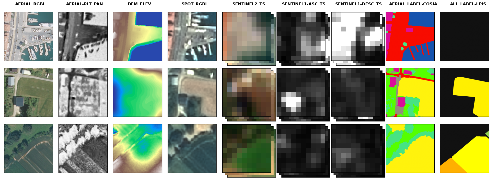
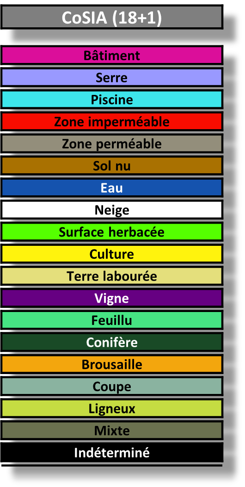
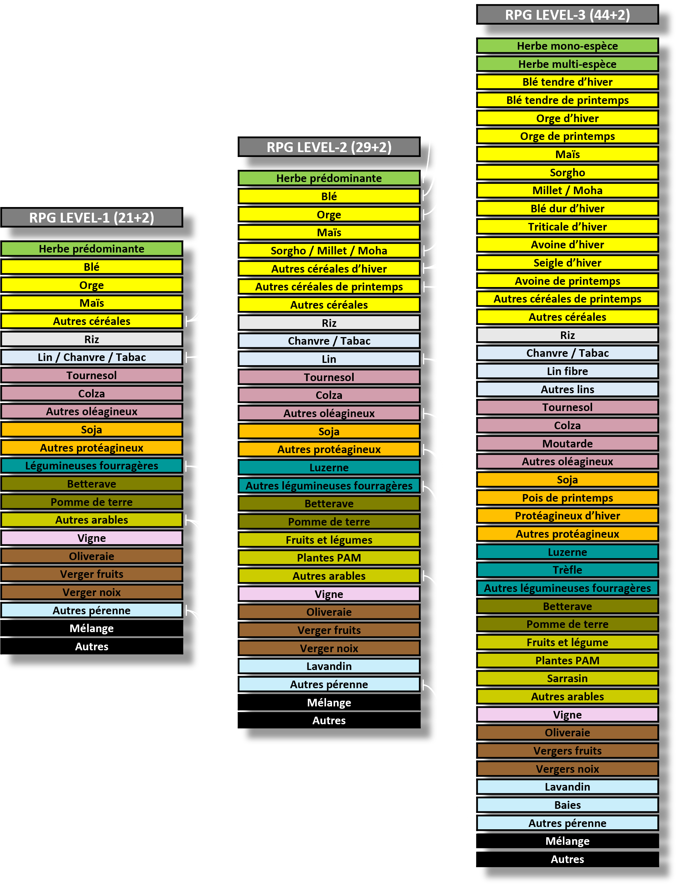
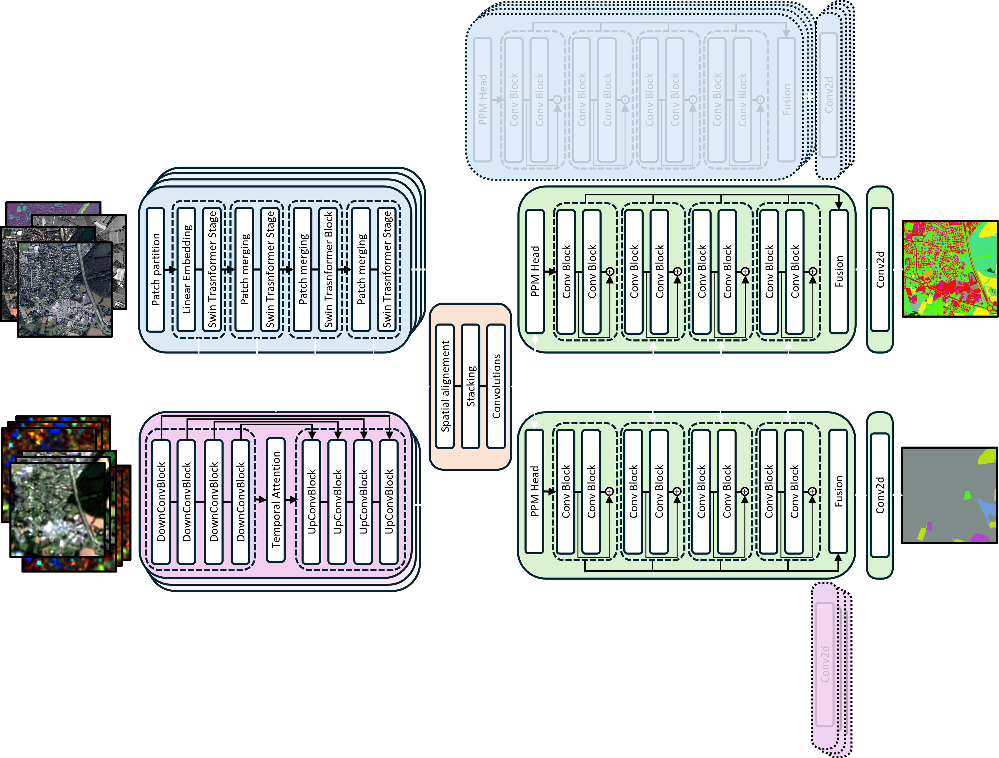

<div style="position: relative; text-align: center;">
  <a href="./flairhub.html" style="font-size: 11pt;"><b>🇬🇧 English version</b></a><br>
  
</div>
<br>


<center>
  
### 🌍 Sommaire

<table style="width:100%; max-width:400px; border: 2px solid red; border-radius: 12px; background-color: rgb(61, 60, 60); border-collapse: separate; border-spacing: 0;">
  <tbody style="color: #1e1e1e; font-size: 1.05em;">
    <tr><td style="border: none; padding: 10px;"></td></tr>
    <tr><td style="border: none; padding: 4px 25px;">➡&nbsp;🔗&nbsp;<a href="#LINKS" style="color: lightgreen;"><b>Liens utiles</b></a></td></tr>
    <tr><td style="border: none; padding: 4px 25px;">➡&nbsp;🎯&nbsp;<a href="#FIGURES" style="color: lightgreen;"><b>Chiffres clés</b></a></td></tr>
    <tr><td style="border: none; padding: 4px 25px;">➡&nbsp;🗂️&nbsp;<a href="#MODALITIES" style="color: lightgreen;"><b>Modalités du dataset</b></a></td></tr>
    <tr><td style="border: none; padding: 4px 25px;">➡&nbsp;🏷️&nbsp;<a href="#SUPERVISION" style="color: lightgreen;"><b>Supervision</b></a></td></tr>
    <tr><td style="border: none; padding: 4px 25px;">➡&nbsp;🧱&nbsp;<a href="#ARCHI" style="color: lightgreen;"><b>Architecture de référence</b></a></td></tr>
    <tr><td style="border: none; padding: 4px 25px;">➡&nbsp;🧭&nbsp;<a href="#FLAIRs" style="color: lightgreen;"><b>Défis FLAIR précédents</b></a></td></tr>    
    <tr><td style="border: none; padding: 10px;"></td></tr>
  </tbody>
</table>
</center>

<hr>


<center>
<table style="width:100%; max-width:1400px; border-collapse: separate; border-spacing: 0;">
  <thead>
    <tr>
      <th colspan="3" style="
        text-align: center;
        padding: 2% 15%;
        border: none;
        background-color: transparent;
        color: inherit;
        font-weight: bold;
      ">
        FLAIR-HUB intègre et étend les jeux de données FLAIR#1 et FLAIR#2 pour former une ressource unifiée, à grande échelle et multi-capteur, dédiée à l’occupation du sol, avec des annotations à très haute résolution. Couvrant plus de 2 500 km² de paysages et d’éco-climats variés à travers la France, il contient plus de 63 milliards de pixels annotés manuellement, répartis sur 19 classes d’occupation du sol et 23 classes de types de cultures.<br><br>
        Ce jeu de données aligne des sources complémentaires, incluant l’imagerie aérienne, les satellites SPOT et Sentinel, des donnés d'élévation, ainsi que des photographies aériennes historiques, apportant une diversité spatiale, spectrale et temporelle riche. FLAIR-HUB soutient le développement de méthodes de segmentation sémantique, de fusion multimodale et d’apprentissage auto-supervisé, et continuera d’évoluer avec de nouvelles modalités et annotations.
      </th>
    </tr>
  </thead>
</table>
</center>

<p align="center"></p>


<hr><br><a id="LINKS"></a>

### 🔗 Liens utiles

<center>
<table style="width:100%; max-width:1200px; background-color:rgb(61, 60, 60); border: 2px solid green; border-radius: 12px; border-collapse: separate; border-spacing: 0;">
  <tbody style="color: white; font-size: 1.05em;">
    <tr><td style="border: none; padding: 4px 20px;">📄 <a href="https://arxiv.org/pdf/2211.12979.pdf" target="_blank" style="color: lightgreen;"><b>Data Paper</b></a> – Learn more about the dataset in the official publication</td></tr>
    <tr><td style="border: none; padding: 4px 20px;">📁 <a href="https://huggingface.co/datasets/IGNF/FLAIR-HUB" target="_blank" style="color: lightgreen;"><b>Téléchargez le jeu de données jouet</b></a> – Inclut toutes les modalités dans une version allégée (accès direct)</td></tr>
    <tr><td style="border: none; padding: 4px 20px;">📁 <a href="https://huggingface.co/datasets/IGNF/FLAIR-HUB" target="_blank" style="color: lightgreen;"><b>Téléchargez le jeu de données complet</b></a> – Accédez à l'intégralité de FLAIR-HUB sur HuggingFace</td></tr>
    <tr><td style="border: none; padding: 4px 20px;">🤖 <a href="https://huggingface.co/datasets/IGNF/FLAIR-HUB" target="_blank" style="color: lightgreen;"><b>Modèles pré-entraînés</b></a> – Explorez les modèles développés sur FLAIR-HUB</td></tr>
    <tr><td style="border: none; padding: 4px 20px;">💻 <a href="https://github.com/IGNF/FLAIR-HUB" target="_blank" style="color: lightgreen;"><b>Code source (GitHub)</b></a> – Scripts d'entraînement, de prétraitement et de benchmark</td></tr>
    <tr><td style="border: none; padding: 4px 20px;">✉️ <a href="mailto:flair@ign.fr" style="color: lightgreen;"><b>Nous contacter</b></a> – flair@ign.fr – Pour toute question ou proposition de collaboration !</td></tr>
  </tbody>
</table>
</center>


<br><hr>

### 📚 Citation

Si vous utilisez FLAIR-HUB, veuillez citer :

```
Anatol Garioud, Sébastien Giordano, Nicolas David, Nicolas Gonthier. 
FLAIR-HUB: semantic segmentation and domain adaptation dataset. (2025). 
DOI: https://doi.org/10.13140/RG.2.2.30183.73128/1
```

```bibtex
@article{ign2025flairhub,
  doi = {10.13140/RG.2.2.30183.73128/1},
  url = {https://arxiv.org/pdf/2211.12979.pdf},
  author = {Garioud, Anatol and Giordano, Sébastien and David, Nicolas and Gonthier, Nicolas},
  title = {FLAIR #1: semantic segmentation and domain adaptation dataset},
  publisher = {arXiv},
  year = {2025}
}
```


<br><hr><br><a id="FIGURES"></a>


### 🎯 Chiffres clés du jeu de données FLAIR-HUB

<br>


<center>
<table style="width:95%;max-width:600px;">

  <tbody>
    <tr><td>🗺️</td><td>ROI / Surface couverte</td><td style="text-align: center">2,822 ROIs / 2,528 km²</td></tr>
    <tr><td>🏛️</td><td>Départements (France)</td><td style="text-align: center">74</td></tr>
    <tr><td>🧩</td><td>Patches IA (512×512 px)</td><td style="text-align: center">241,100</td></tr>
    <tr><td>🖼️</td><td>Pixels annotés</td><td style="text-align: center">63.2 milliard</td></tr>
    <tr><td>🛰️</td><td>Acquisitions Sentinel-2</td><td style="text-align: center">256,221</td></tr>
    <tr><td>📡</td><td>Acquisitions Sentinel-1</td><td style="text-align: center">532,696</td></tr>
    <tr><td>📁</td><td>Fichiers</td><td style="text-align: center">~2.5 million</td></tr>
    <tr><td>💾</td><td>Taille totale</td><td style="text-align: center">~750 GB</td></tr>
  </tbody>
</table>
</center>


<br><hr><br><a id="MODALITIES"></a>


### 🗂️ Aperçu des modalités du dataset

<br>

<center>
<table style="width:95%;max-width:600px;">
  <thead>
    <tr>
      <th>Modalité</th>
      <th>Description</th>
      <th style="text-align: center">Résolution / Format</th>
      <th style="text-align: center">Métadonnées</th>
    </tr>
  </thead>
  <tbody>
    <tr>
      <td><strong>BD ORTHO (AERIAL_RGBI)</strong></td>
      <td>Images aériennes orthorectifiées avec 4 bandes (R, V, B, PIR).</td>
      <td style="text-align: center">20 cm, entier non signé 8 bits</td>
      <td style="text-align: center">Statistiques radiométriques, dates/caméras d'acquisition</td>
    </tr>
    <tr>
      <td><strong>BD ORTHO HISTORIQUE (AERIAL-RLT_PAN)</strong></td>
      <td>Images aériennes panchromatiques historiques (1947–1965), rééchantillonnées.</td>
      <td style="text-align: center">~40 cm, réel : 0,4–1,2 m, entier 8 bits</td>
      <td style="text-align: center">Dates, références aux images originales</td>
    </tr>
    <tr>
      <td><strong>ELEVATION (DEM_ELEV)</strong></td>
      <td>Données d'élévation avec canaux MNS (surface) et MNT (terrain).</td>
      <td style="text-align: center">MNS : 20 cm, MNT : 1 m, Float32</td>
      <td style="text-align: center">Hauteur des objets via la différence MNS–MNT</td>
    </tr>
    <tr>
      <td><strong>SPOT (SPOT_RGBI)</strong></td>
      <td>Images satellites SPOT 6-7, 4 bandes, réflectance calibrée.</td>
      <td style="text-align: center">1,6 m (rééchantillonnée)</td>
      <td style="text-align: center">Dates d'acquisition, statistiques radiométriques</td>
    </tr>
    <tr>
      <td><strong>SENTINEL-2 (SENTINEL2_TS)</strong></td>
      <td>Séries temporelles annuelles avec 10 bandes spectrales, réflectance calibrée.</td>
      <td style="text-align: center">10,24 m (rééchantillonnée)</td>
      <td style="text-align: center">Dates, stats radiométriques, masques nuage/neige</td>
    </tr>
    <tr>
      <td><strong>SENTINEL-1 ASC/DESC (SENTINEL1-XXX_TS)</strong></td>
      <td>Séries temporelles radar (VV, VH), rétrodiffusion SAR (σ0).</td>
      <td style="text-align: center">10,24 m (rééchantillonnée)</td>
      <td style="text-align: center">Statistiques par série ascendante/descendante</td>
    </tr>
    <tr>
      <td><strong>LABELS CoSIA (AERIAL_LABEL-COSIA)</strong></td>
      <td>Annotations de couverture du sol à partir de photo-interprétation d'AERIAL_RGBI.</td>
      <td style="text-align: center">20 cm, 15 à 19 classes</td>
      <td style="text-align: center">Aligné avec BD ORTHO, statistiques par patch</td>
    </tr>
    <tr>
      <td><strong>LABELS LPIS (ALL_LABEL-LPIS)</strong></td>
      <td>Informations sur les cultures issues des déclarations PAC, classification hiérarchique.</td>
      <td style="text-align: center">20 cm</td>
      <td style="text-align: center">Aligné temporellement avec BD ORTHO, différences possibles avec CoSIA</td>
    </tr>
  </tbody>
</table>
</center>


<br><p align="center"></p>


<br><hr><br><a id="SUPERVISION"></a>

### 🏷️ Supervision 

FLAIR-HUB propose deux sources complémentaires de supervision : une annotation à haute résolution de l’occupation du sol, réalisée par photo-interprétation experte à partir des images aériennes RGBI. Elle offre une précision au niveau du pixel et couvre 19 classes d’occupation du sol; une annotation issue des déclarations agricoles dans le cadre de la Politique Agricole Commune (PAC). Elle est structurée en une taxonomie hiérarchique allant jusqu’à 46 classes de types de cultures. Alors que CoSIA reflète l’occupation réelle du sol visible sur les images, LPIS correspond à l’usage déclaré des terres par les agriculteurs. Par conséquent, ces deux modalités diffèrent dans leur objectif, leur précision géométrique, et leur alignement spatial.


<center>
<table style="width:100%; max-width:1100px;">
  <tr>
    <td style="text-align:center;">
      
      <div><small>Occupation du sol (CoSIA)</small></div>
    </td>
    <td style="text-align:center;">
      
      <div><small>Types de culture (RPG)</small></div>
    </td>
  </tr>
</table>
</center>


<br><hr><br><a id="ARCHI"></a>

### 🧱 Architecture de référence 

Le modèle de base, <b>FLAIR-UPerFuse</b>, est une architecture modulaire conçue pour la segmentation sémantique à partir de données de télédétection multi-modales et multi-temporelles. Il combine l'extraction spatiale de caractéristiques via un Swin Transformer, le traitement temporel à l’aide d’un encodeur UTAE, un mécanisme de fusion dédié, et un décodeur UPerNet pour produire les cartes de segmentation. L’architecture s’adapte dynamiquement en fonction des modalités disponibles en entrée — qu’elles soient mono-temporelles ou multi-temporelles — et intègre des branches auxiliaires pour améliorer la supervision et faciliter l’apprentissage spécifique à chaque modalité. L'entraînement repose sur une fonction de perte composite qui équilibre les contributions principales et auxiliaires selon les tâches et les modalités considérées.


<br><p align="center"></p><br>


<br><hr><br><a id="FLAIRs"></a>

### 🧭 Défis FLAIR précédents

FLAIR#1 a lancé le tout premier défi à grande échelle pour la cartographie de l’occupation des sols à partir d’images aériennes à très haute résolution (20 cm), accompagnées d’annotations sémantiques expertes sur 812 km² de paysages français variés. Le jeu de données contenait plus de 77 000 patchs annotés selon 19 classes d’occupation des sols (13 utilisées pour l'entraînement) et s’est concentré sur l’adaptation de domaine, avec un test effectué sur des régions et des dates d’acquisition totalement inédites. Le défi a mis en évidence la difficulté de construire des modèles généralisables face à des décalages spatio-temporels marqués. Les modèles de base étaient des U-Net, établissant une première référence pour la segmentation sémantique inter-domaine en télédétection.

🔗 FLAIR#1 dépôt code : https://github.com/IGNF/FLAIR-1 <br>
🔗 FLAIR#1 datapaper  : https://arxiv.org/pdf/2211.12979.pdf

<br>

FLAIR#2 a poursuivi cet effort en intégrant des séries temporelles Sentinel-2 en plus des images aériennes, afin d’aborder la fusion multimodale et l’apprentissage temporel. Avec plus de 20 milliards de pixels annotés sur 817 km² et 916 zones, FLAIR#2 introduit 13 classes principales et exploite des super-patchs spatio-temporels pour enrichir le contexte. Le jeu de données couvre 50 domaines spatiaux et intègre plus de 51 000 acquisitions Sentinel-2. Un modèle de référence bi-branche (U-T&T), combinant U-Net et U-TAE, a démontré l’intérêt de fusionner texture mono-date et spectre multi-temporel. Le défi met en avant la fusion inter-résolution, l’hétérogénéité capteur et l’apprentissage robuste à partir de données étiquetées parcimonieusement.

🔗 FLAIR#2 dépôt code : https://github.com/IGNF/FLAIR-2 <br>
🔗 FLAIR#2 datapaper  : https://arxiv.org/abs/2310.13336

<br>


🎖️ <b>Podiums des défis<b/>

<div style="display: flex; flex-direction: row; justify-content: center; gap: 40px; flex-wrap: wrap; font-size: 1.05em; line-height: 1.6;"> <div style="background-color: #2c2c2c; border-radius: 10px; padding: 15px 20px; border-left: 5px solid gold; min-width: 250px;"> <b>🏁 FLAIR#1 – Test</b><br> 🥇 <b>businiao</b> — 0.65920<br> 🥈 Breizhchess — 0.65600<br> 🥉 wangzhiyu918 — 0.64930 </div> 

<div style="background-color: #2c2c2c; border-radius: 10px; padding: 15px 20px; border-left: 5px solid silver; min-width: 250px;"> <b>🏁 FLAIR#2 – Test</b><br> 🥇 <b>strakajk</b> — 0.64130<br> 🥈 Breizhchess — 0.63550<br> 🥉 qwerty64 — 0.63510 </div> </div>
