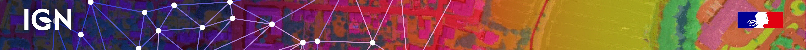
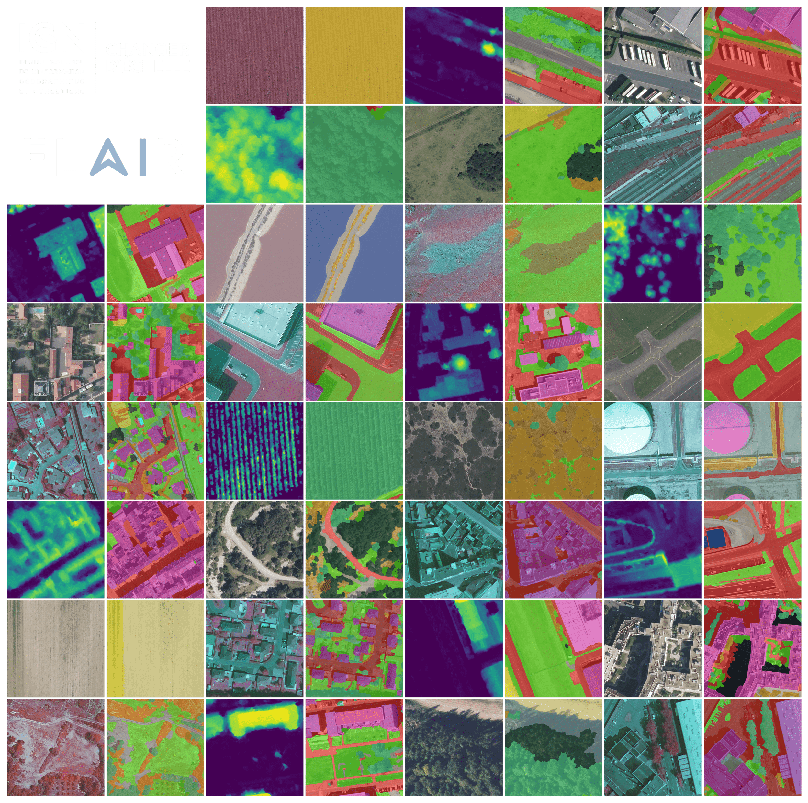
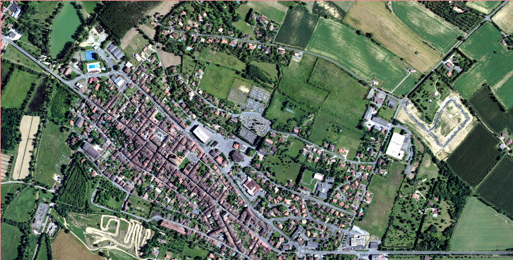
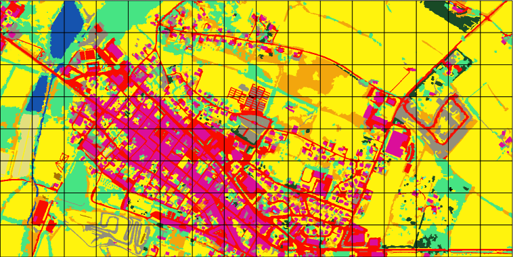
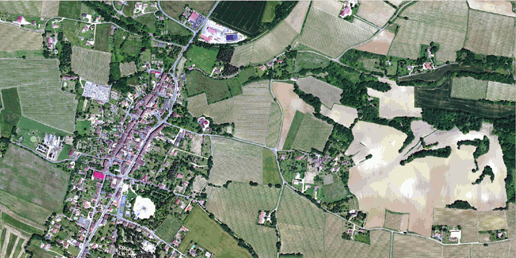

# Welcome to IGN's FLAIR datasets page!

<p align="center"></p><br/>

The French National Institute of Geographical and Forest Information (IGN) presents its AI challenges and benchmark datasets FLAIR (for French Land cover from Aerospace ImageRy). 

<!---
[Learn more about the context of these challenges.](./why_flair.html)<br>
--->

<hr>
<a style="font-size: 9pt" href="./index_fr.html"><b>Version française</b></a>
<br/><br/>


<br/><br/>
## FLAIR #1 : semantic segmentation and domain adaptation 🌍🌱🏠🌳➡️🛩️

Challenge organized by IGN with the support of the <a href="https://www.sfpt.fr/"><b>SFPT.</b></a><br>
The challenge took place on Codalab from November, 21st 2022 to March, 21st 2023. See the results <a href="https://codalab.lisn.upsaclay.fr/competitions/8769"><b>here.</b></a><br/><br/><br/>

>FLAIR #1 <b>datapaper  &#128209;</b>  : https://arxiv.org/pdf/2211.12979.pdf <br/>
>FLAIR #1 <b>repository &#128193;</b> : https://github.com/IGNF/FLAIR-1-AI-Challenge (coming soon)

<br/><br/>
<p align="center"></p><br>

### Description

We present here a large dataset ( >20 billion pixels) of aerial imagery, topographic information and land cover (buildings, water, forest, agriculture...) annotations with the aim to further advance research on semantic segmentation , domain adaptation and transfer learning. Countrywide remote sensing aerial imagery is by necessity acquired at different times and dates and under different conditions. Likewise, at large scales, the characteristics of semantic classes can vary depending on location and become heterogenous. This opens up challenges for the spatial and temporal generalization of deep learning models! 

The FLAIR-one dataset consists of 77,412 high resolution patches (512x512 at 0.2 m spatial resolution) with 19 semantic classes. For this challenge and the associated baselines, due to imbalanced class frequencies, the number of classes has been reduced to 13 (remapping >12 to 13, see the datapaper for explanation).<br/>

<center>
<table style="width:80%">
<thead>
  <tr><th width=7%></th><th>Class</th><th style='text-align: center' width=15%>Value</th><th style='text-align: center'>Freq.-train (%)</th><th style='text-align: center'>Freq.-test (%)</th></tr>
</thead>
<tbody>
  <tr><td bgcolor='#db0e9a'></td><td>building</td><td style='text-align: center'>1</td><td style='text-align: center'>8.14</td><td style='text-align: center'>8.6</td></tr>
  
  <tr><td bgcolor='#938e7b'></td><td>pervious surface</td><td style='text-align: center'>2</td><td style='text-align: center'>8.25</td><td style='text-align: center'>7.34</td></tr>
  
  <tr><td bgcolor='#f80c00'></td><td>impervious surface</td><td style='text-align: center'>3</td><td style='text-align: center'>13.72</td><td style='text-align: center'>14.98</td></tr>
  
  <tr><td bgcolor='#a97101'></td><td>bare soil</td><td style='text-align: center'>4</td><td style='text-align: center'>3.47</td><td style='text-align: center'>4.36</td></tr>
  
  <tr><td bgcolor='#1553ae'></td><td>water</td><td style='text-align: center'>5</td><td style='text-align: center'>4.88</td><td style='text-align: center'>5.98</td></tr>
  
  <tr><td bgcolor='#194a26'></td><td>coniferous</td><td style='text-align: center'>6</td><td style='text-align: center'>2.74</td><td style='text-align: center'>2.39</td></tr>
  
  <tr><td bgcolor='#46e483'></td><td>deciduous</td><td style='text-align: center'>7</td><td style='text-align: center'>15.38</td><td style='text-align: center'>13.91</td></tr>
  
  <tr><td bgcolor='#f3a60d'></td><td>brushwood</td><td style='text-align: center'>8</td><td style='text-align: center'>6.95</td><td style='text-align: center'>6.91</td></tr>
  
  <tr><td bgcolor='#660082'></td><td>vineyard</td><td style='text-align: center'>9</td><td style='text-align: center'>3.13</td><td style='text-align: center'>3.87</td></tr>
  
  <tr><td bgcolor='#55ff00'></td><td>herbaceous vegetation</td><td style='text-align: center'>10</td><td style='text-align: center'>17.84</td><td style='text-align: center'>22.17</td></tr>
  
  <tr><td bgcolor='#fff30d'></td><td>agricultural land</td><td style='text-align: center'>11</td><td style='text-align: center'>10.98</td><td style='text-align: center'>6.95</td></tr>
  
  <tr><td bgcolor='#e4df7c'></td><td>plowed land</td><td style='text-align: center'>12</td><td style='text-align: center'>3.88</td><td style='text-align: center'>2.25</td></tr>
  
  <tr><td bgcolor='#3de6eb'></td><td>swimming pool</td><td style='text-align: center'>13</td><td style='text-align: center'>0.03</td><td style='text-align: center'>0.04</td></tr>
  
  <tr><td bgcolor='#ffffff'></td><td>snow</td><td style='text-align: center'>14</td><td style='text-align: center'>0.15</td><td style='text-align: center'>-</td></tr>
  
  <tr><td bgcolor='#8ab3a0'></td><td>clear cut</td><td style='text-align: center'>15</td><td style='text-align: center'>0.15</td><td style='text-align: center'>0.01</td></tr>
  
  <tr><td bgcolor='#6b714f'></td><td>mixed</td><td style='text-align: center'>16</td><td style='text-align: center'>0.05</td><td style='text-align: center'>-</td></tr>
  
  <tr><td bgcolor='#c5dc42'></td><td>ligneous</td><td style='text-align: center'>17</td><td style='text-align: center'>0.01</td><td style='text-align: center'>0.03</td></tr>
  
  <tr><td bgcolor='#9999ff'></td><td>greenhouse</td><td style='text-align: center'>18</td><td style='text-align: center'>0.12</td><td style='text-align: center'>0.2</td></tr>
  
  <tr><td bgcolor='#000000'></td><td>other</td><td style='text-align: center'>19</td><td style='text-align: center'>0.14</td><td style='text-align: center'>-</td></tr>
</tbody>
</table>
</center>


The dataset covers a total of approximatly 812 km², with patches that have been sampled accross the entire metropolitan French territory to be illustrating the different climate and landscapes (spatial domains). The aerial images included in the dataset were acquired during different months and years (temporal domains).


<table>
    <tr>
        <td style="text-align: center"></td>
        <td style="text-align: center"></td>
    </tr>
    <tr>
        <td style="text-align: center">Aerial image ORHTO HR&#174;</td>
        <td style="text-align: center">Labels</td>
    </tr>
</table>


The test dataset consists of 15,700 patches from 10 domains not included in the train dataset. Class frequency and temporal domains of the test dataset includes a shift from the train dataset allowing to assess the domain adaptation capabilities of developped approaches.
<br/><br/>

### Baseline model

A U-Net architecture with a pre-trained ResNet34 encoder from the pytorch segmentation models library has been used for the baselines. The used architecture allows integration of patch-wise metadata information and employs commonly used image data augmentation techniques. Codes are available in the FLAIR #1 repository.
<br/><br/>

<p align="center"></p>
<br/><br/>

### Datasets

<table>
  <tr>
    <th>Data</th>
    <th>Size</th>
    <th>Type</th>
    <th>Link</th>
 </tr>
 <tr><td colspan="4" height = 10px></td>
 </tr>
  <tr>
    <td>Aerial images - train</td>
    <td>50.7 Go</td>
    <td>.zip</td>
    <td><a style="font-size: 10pt" href="https://storage.gra.cloud.ovh.net/v1/AUTH_366279ce616242ebb14161b7991a8461/defi-ia/flair_data_1/flair_aerial_train.zip"><b>download</b></a>
  </tr>
   <tr>
    <td>Aerial images - test</td>
    <td>13.4 Go</td>
    <td>.zip</td>
    <td><a style="font-size: 10pt" href="https://storage.gra.cloud.ovh.net/v1/AUTH_366279ce616242ebb14161b7991a8461/defi-ia/flair_data_1/flair_1_aerial_test.zip"><b>download</b></a>
  </tr>
  <tr>
    <td>Labels - train</td>
    <td>485 Mo</td>
    <td>.zip</td>
    <td><a style="font-size: 10pt" href="https://storage.gra.cloud.ovh.net/v1/AUTH_366279ce616242ebb14161b7991a8461/defi-ia/flair_data_1/flair_labels_train.zip"><b>download</b></a>
  </tr>
  <tr style="cellspacing: 10px">
    <td>Labels - test</td>
    <td>124 Mo</td>
    <td>.zip</td>
    <td><a style="font-size: 10pt" href="https://storage.gra.cloud.ovh.net/v1/AUTH_366279ce616242ebb14161b7991a8461/defi-ia/flair_data_1/flair_1_labels_test.zip"><b>download</b></a>
  </tr>
  <tr><td colspan="4" height=10px style="outline: "></td>
  <tr>
    <td>Aerial metadata</td>
    <td>16.1 Mo</td>
    <td>.json</td>
    <td><a style="font-size: 10pt" href="https://storage.gra.cloud.ovh.net/v1/AUTH_366279ce616242ebb14161b7991a8461/defi-ia/flair_data_1/flair-1_metadata_aerial.zip"><b>download</b></a>
  </tr>
  <tr>
    <td>Areas shapes</td>
    <td>392 Ko</td>
    <td>.gpkg</td>
    <td><a style="font-size: 10pt" href="https://storage.gra.cloud.ovh.net/v1/AUTH_366279ce616242ebb14161b7991a8461/defi-ia/flair_data_1/flair_1_shapes.gpkg"><b>download</b></a>
  </tr>
  <tr><td colspan="4" height=10px style="outline: "></td>
  <tr>
    <td>Toy dataset (subset of train and test)</td>
    <td>215 Mo</td>
    <td>.zip</td>
    <td><a style="font-size: 10pt" href="https://storage.gra.cloud.ovh.net/v1/AUTH_366279ce616242ebb14161b7991a8461/defi-ia/flair_data_1/flair_1_toy_dataset.zip"><b>download</b></a>
  </tr>
</table>
<br/><br/>

### Reference

Please include a citation to the following paper if you use the FLAIR #1 dataset: 

```
@article{garioud2022flair1,
  doi = {10.13140/RG.2.2.30183.73128/1},
  url = {https://arxiv.org/pdf/2211.12979.pdf},
  author = {Garioud, Anatol and Peillet, Stéphane and Bookjans, Eva and Giordano, Sébastien and Wattrelos, Boris},
  title = {FLAIR #1: semantic segmentation and domain adaptation dataset},
  publisher = {arXiv},
  year = {2022}
}
```

<br/><br/><br/>

## FLAIR #2 : texture and time from multimodal optical imagery for semantic segmentation 🌍🌱🏠🌳➡️🛩️🛰️
 
Challenge organized by IGN with the support of the <a href="https://cnes.fr/en"><b>CNES.</b></a>

<br/>
<b>Coming soon !</b> 

<!---
FLAIR #2 repository : https://github.com/IGNF/FLAIR-2-AI-Challenge
-->
