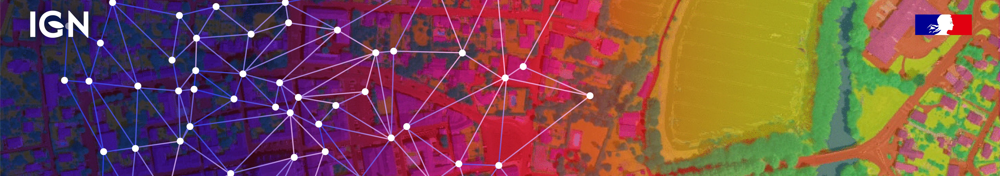
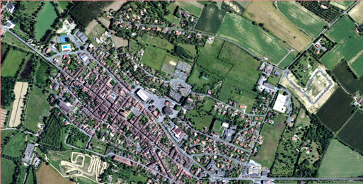
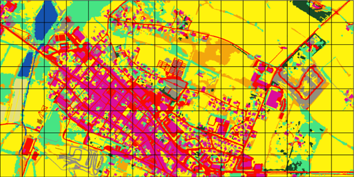

# Challenges FLAIR 

*Artificial Intelligence challenges organised around geo-data and deep learning*

Welcome to the IGN AI Challenges ! 

The French National Institute of Geographical and Forest Information (IGN) presents its AI Challenge and benchmark datasets, the FLAIR (for French Land cover from Aerospace ImageRy) challenges. [Learn more about the context of these challenges.](./why_flair.html) 

You can reach us at : <a href = "mailto:ai-challenge@ign.fr?subject=FLAIR - AI challenge @IGN">ai-challenge@ign.fr</a>
  

## FLAIR #1 : semantic segmentation and domain adaptation

The challenge took place on Codalab from the November, 21st 2022 to March, 21st 2023. See the results <a style="font-size: 12pt" href="https://codalab.lisn.upsaclay.fr/competitions/8769"><b>here.</b></a> 

FLAIR #1 <b>datapaper  &#128209;</b>  : https://arxiv.org/pdf/2211.12979.pdf  
FLAIR #1 <b>repository &#128193;</b> : https://github.com/IGNF/FLAIR-1-AI-Challenge 

### Description

We present here a large dataset ( >20 billion pixels) of aerial imagery, topographic information and land cover (buildings, water, forest, agriculture...) annotations with the aim to further advance research on semantic segmentation , domain adaptation and transfer learning. Countrywide remote sensing aerial imagery is by necessity acquired at different times and dates and under different conditions. Likewise, at large scales, the characteristics of semantic classes can vary depending on location and become heterogenous. This opens up challenges for the spatial and temporal generalization of deep learning models! 

The FLAIR-one dataset consists of 77,412 high resolution (0.2 m spatial resolution) patches with 13 semantic classes (19 original classes remapped to 13, see the associated datapaper for explanation). The dataset covers a total of approximatly 800 km², with patches that have been sampled accross the entire metropolitan French territory to be illustrating the different climate and landscapes (spatial domains). The aerial images included in the dataset were acquired during different months and years (temporal domains).

<table>
    <tr>
        <td style="text-align: center"></td>
        <td style="text-align: center"></td>
    </tr>
    <tr>
        <td style="text-align: center">ORTHO HR&#174;</td>
        <td style="text-align: center">Labels</td>
    </tr>
</table>

The test dataset consists of 15,700 patches from 10 domains not included in the train dataset. Class frequency and temporal domains of the test dataset includes a shift from the train dataset allowing to assess the domain adaptation capabilities of developped approaches.

### Baseline model

A U-Net architecture with a pre-trained ResNet34 encoder from the pytorch segmentation models library has been used for the baselines. The used architecture allows integration of patch-wise metadata information and employs commonly used image data augmentation techniques. Codes are available in the FLAIR #1 repository.

### Datasets

|Data          |Volume  | Link   |
|--------------|--------|--------|
|Aerial images |        |        |
|Labels        |        |        |
|Toy dataset   |        |        |
|Metadata      |        |        |

  

## FLAIR #2 : texture and time from multimodal optical imagery for segmentic segmentation 

<b>Coming soon !</b> 

<!---
FLAIR #2 repository : https://github.com/IGNF/FLAIR-2-AI-Challenge
-->
