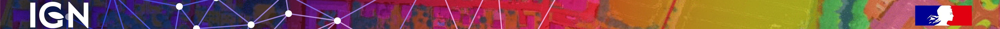

🇫🇷 <a style="font-size: 11pt" href="./index_fr.html"><b>Version française</b></a>

# Welcome to IGN's FLAIR datasets page!

<!---
[Learn more about the context of these challenges.](./why_flair.html) 
--->

  <table style="width:100%; max-width:1400px; border-collapse: collapse;">
    <thead>
      <tr>
        <th></th>
        <th colspan="2" style="text-align: center; padding: 2% 8%;">
          

          The French National Institute of Geographical and Forest Information (IGN) presents its AI challenges and benchmark datasets FLAIR (for French Land cover from Aerospace ImageRy). The FLAIR datasets include Earth Observation data from different aerospace sensors. These datasets cover large scales and reflect real world cases of land cover mapping tasks.  
          We are committed to supporting research and fostering innovation in the fields of Earth Observation. For any question concerning the data, their access and exploitation, as well as for any idea of future datasets or suggestion of topics, simply contact us at the address: 
            <a href="mailto:flair@ign.fr?subject=FLAIR @IGN">flair@ign.fr</a>
          

        </th>
        <th></th>
      </tr>
    </thead>
    <tbody>
    <tr>
      <td></td>
      <td colspan="2" style="text-align: center; padding: 2% 4%;">
        

          <code style="padding: 4px 8px; font-size: 1em; color: #c7254e; border-radius: 4px;">Explore the datasets and baseline codes:</code>
        

        

          <a href="./FLAIR1/flair_1.html"
             style="flex: 1; min-width: 250px; max-width: 300px; padding: 20px;
                    background: #1e1e1e; color: #e0ffe0; border-radius: 12px;
                    border: 1px solid #006400;
                    text-align: center; text-decoration: none;
                    box-shadow: 0 2px 6px rgba(0,0,0,0.3);"
             onmouseover="this.style.textDecoration='underline';"
             onmouseout="this.style.textDecoration='none';">
            <h3 style="margin: 0 0 10px; color: #90ee90;">🛩️ FLAIR #1</h3>
            
First challenge around aerial imagery.

          </a>
          <a href="./FLAIR2/flair_2.html"
             style="flex: 1; min-width: 250px; max-width: 300px; padding: 20px;
                    background: #1e1e1e; color: #e0ffe0; border-radius: 12px;
                    border: 1px solid #006400;
                    text-align: center; text-decoration: none;
                    box-shadow: 0 2px 6px rgba(0,0,0,0.3);"
             onmouseover="this.style.textDecoration='underline';"
             onmouseout="this.style.textDecoration='none';">
            <h3 style="margin: 0 0 10px; color: #90ee90;">🛰️ FLAIR #2</h3>
            
Second challenge with satellite time series.

          </a>
          <a href="./FLAIR-HUB/flairhub.html"
             style="flex: 1; min-width: 250px; max-width: 300px; padding: 20px;
                    background: #1e1e1e; color: #e0ffe0; border-radius: 12px;
                    border: 1px solid #006400;
                    text-align: center; text-decoration: none;
                    box-shadow: 0 2px 6px rgba(0,0,0,0.3);"
             onmouseover="this.style.textDecoration='underline';"
             onmouseout="this.style.textDecoration='none';">
            <h3 style="margin: 0 0 10px; color: #90ee90;">🌍 FLAIR-HUB</h3>
            
Unified dataset with 6 modalities & wider coverage.

          </a>
        

      </td>
      <td></td>
    </tr>
      <tr>
        <td></td>
        <td colspan="2" style="text-align: center; padding: 3% 8%;">
          

            The FLAIR datasets are released under the 
            <a href="https://www.etalab.gouv.fr/wp-content/uploads/2018/11/open-licence.pdf" target="_blank"><strong>Open Licence 2.0</strong></a> from Etalab. 
            Please remember to cite the associated datapaper with each dataset.
          

          
        </td>
        <td></td>
      </tr>
    </tbody>
  </table>

  <!-- Card 1 -->
  

    
  

  <!-- Card 2 -->
  

    
  

  <!-- Card 3 -->
  

    
  

  <!-- Card 4 -->
  

    
  

  <!-- Card 5 -->
  

    
  

  <!-- Card 6 -->
  

    
  

