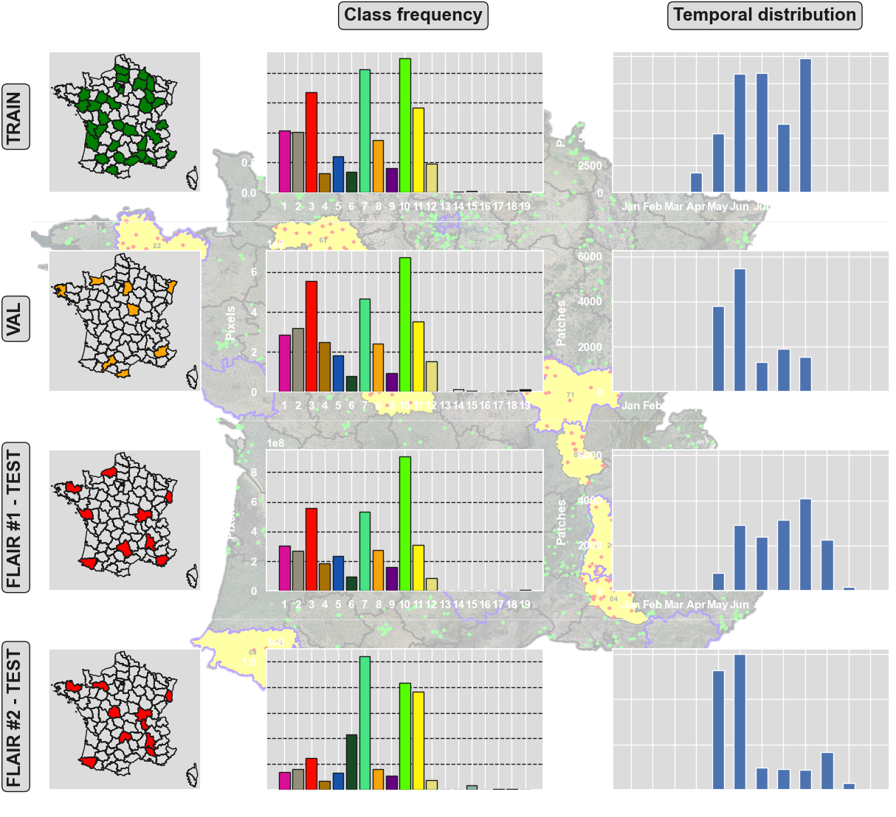
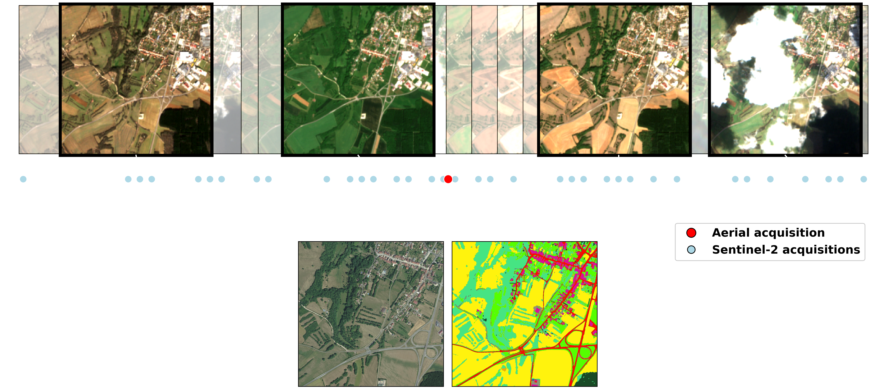

<a style="font-size: 9.5pt" href="./index.html"><b>English version</b></a>

# Bienvenue sur la page des datasets FLAIR de l'IGN

<p align="center"></p>
<!---
[En savoir plus sur le contexte de ces défis.](./pourquoi_flair.html) <br>
--->
<center>
<table style="width:100%;max-width:1400px;">
<tr>
<td width=40% style="text-align: center; padding: 40px">L'Institut national de l'information géographique et forestière (IGN) présente ses défis en matière d'IA et ses jeux de données de référence FLAIR (pour French Land cover from Aerospace ImageRy). Les jeux de données FLAIR mettent à disposition des données d'observation de la Terre provenant de différents capteurs aérospatiaux. Ces jeux de données couvrent de larges échelles et reflètent des cas réels et complexes de cartographie de l'occupation du sol.
<br><br>
  
<div style="padding: 5px; border: 1px solid red; margin-bottom: 8px;">    
<code style="padding: 2px 4px; font-size: 100%; color: #c7254e;  border-radius: 0;">Explorez les jeux de données et les codes associés ! </code><br/><br/>
<ul style="list-style-type:none;">
<li> <a style="font-size: 11.5pt" href="#FLAIR1">Défi FLAIR #1: imagerie aérienne</a></li>
<li> <a style="font-size: 11.5pt" href="#FLAIR2">Défi FLAIR #2: dataset multimodal optique</a></li>
</ul>
</div>
<br>
Nous nous engageons à soutenir la recherche et à favoriser l'innovation dans les domaines de l'observation de la Terre. Pour toute question concernant les données, leur accès et leur exploitation, ainsi que pour toute idée de futurs jeux de données ou suggestion de sujets, contactez nous à l'adresse suivante:<br/> <a href = "mailto:ai-challenge@ign.fr?subject=FLAIR - AI challenge @IGN">ai-challenge@ign.fr</a> 
<br><br>
<br><br>Les jeux de données FLAIR sont sous la licence <a href="https://www.etalab.gouv.fr/wp-content/uploads/2017/04/ETALAB-Licence-Ouverte-v2.0.pdf" target="_blank"><b>Licence Ouverte 2.0</b></a> d'Etalab. Faites mention de la paternité du jeu de données en citant le datapapers associé.
</td>

<td width=60% style="text-align: center"></td>
</tr>
</table>
</center>

<hr>

<br><br/><br/><a id="FLAIR1"></a><br/><br/>


## FLAIR #1 : segmentation sémantique et adaptation de domaine 🌍🌱🏠🌳➡️🛩️

Challenge organisé par l'IGN avec le soutient de la <a href="https://www.sfpt.fr/" target="_blank"><b>SFPT.</b></a>
Ce challenge s'est déroulé du 21 Novembre 2022 au 21 Mars 2023. Vous pouvez consulter les résultats <a style="font-size: 10pt" href="https://codalab.lisn.upsaclay.fr/competitions/8769" target="_blank"><b>ici.</b></a><br/><br/><br/>

>FLAIR #1 <b> datapaper  &#128209;</b>  : https://arxiv.org/pdf/2211.12979.pdf <br/>
>FLAIR #1 <b> dépôt github &#128193;</b> : https://github.com/IGNF/FLAIR-1-AI-Challenge

<br/><br/>
<p align="center"></p><br>

### Description

Avec des données acquises sur 50 départements et plus de 20 milliards de pixels annotés, ce jeu de données représente la diversité du territoire métropolitain, ses climats, ses écosystèmes et ses sols, dans le but de produire une cartographie à grande échelle. Différentes bases de données IGN (BD Ortho, RGE Alti) ainsi que des annotations produites manuellement par des experts photo-interprètes ont été assemblées pour permettre l’entraînement de modèles IA.

Les images aériennes de télédétection à l'échelle d'un pays sont nécessairement acquises à des dates et des heures différentes et dans des conditions différentes. De même, à grande échelle, les caractéristiques des classes sémantiques peuvent varier et devenir hétérogènes. Cela soulève des challenges pour la généralisation spatiale et temporelle des modèles d'apprentissage profond !

Le dataset FLAIR#1 est composé de 77,412 patches de 512x512 (résolution spatiale de 0.2m) avec une sémantique à 19 classes. Spécifiquement pour le challenge et les baselines associées et en raison d'une fréquence par classe déséquilibrée, la sémantique a été modifiée à 13 classes (>12 -> 13). Rapportez-vous au datapaper pour plus de précisions.<br/>

<center>
<table style="width:80%;max-width:700px;">
<thead>
  <tr><th width=7%></th><th>Classe</th><th style='text-align: center' width=15%>Valeur</th><th style='text-align: center'>Freq.-entraînement (%)</th><th style='text-align: center'>Freq.-test (%)</th></tr>
</thead>
<tbody>
  <tr><td bgcolor='#db0e9a'></td><td>bâtiment</td><td style='text-align: center'>1</td><td style='text-align: center'>8.14</td><td style='text-align: center'>8.6</td></tr>
  
  <tr><td bgcolor='#938e7b'></td><td>zone perméable</td><td style='text-align: center'>2</td><td style='text-align: center'>8.25</td><td style='text-align: center'>7.34</td></tr>
  
  <tr><td bgcolor='#f80c00'></td><td>zone imperméable</td><td style='text-align: center'>3</td><td style='text-align: center'>13.72</td><td style='text-align: center'>14.98</td></tr>
  
  <tr><td bgcolor='#a97101'></td><td>sol nu</td><td style='text-align: center'>4</td><td style='text-align: center'>3.47</td><td style='text-align: center'>4.36</td></tr>
  
  <tr><td bgcolor='#1553ae'></td><td>eau</td><td style='text-align: center'>5</td><td style='text-align: center'>4.88</td><td style='text-align: center'>5.98</td></tr>
  
  <tr><td bgcolor='#194a26'></td><td>conifères</td><td style='text-align: center'>6</td><td style='text-align: center'>2.74</td><td style='text-align: center'>2.39</td></tr>
  
  <tr><td bgcolor='#46e483'></td><td>feuillus</td><td style='text-align: center'>7</td><td style='text-align: center'>15.38</td><td style='text-align: center'>13.91</td></tr>
  
  <tr><td bgcolor='#f3a60d'></td><td>brousaille</td><td style='text-align: center'>8</td><td style='text-align: center'>6.95</td><td style='text-align: center'>6.91</td></tr>
  
  <tr><td bgcolor='#660082'></td><td>vigne</td><td style='text-align: center'>9</td><td style='text-align: center'>3.13</td><td style='text-align: center'>3.87</td></tr>
  
  <tr><td bgcolor='#55ff00'></td><td>pelouse</td><td style='text-align: center'>10</td><td style='text-align: center'>17.84</td><td style='text-align: center'>22.17</td></tr>
  
  <tr><td bgcolor='#fff30d'></td><td>culture</td><td style='text-align: center'>11</td><td style='text-align: center'>10.98</td><td style='text-align: center'>6.95</td></tr>
  
  <tr><td bgcolor='#e4df7c'></td><td>terre labourée</td><td style='text-align: center'>12</td><td style='text-align: center'>3.88</td><td style='text-align: center'>2.25</td></tr>
  
  <tr><td bgcolor='#3de6eb'></td><td>piscine</td><td style='text-align: center'>13</td><td style='text-align: center'>0.03</td><td style='text-align: center'>0.04</td></tr>
  
  <tr><td bgcolor='#ffffff'></td><td>neige</td><td style='text-align: center'>14</td><td style='text-align: center'>0.15</td><td style='text-align: center'>-</td></tr>
  
  <tr><td bgcolor='#8ab3a0'></td><td>coupe</td><td style='text-align: center'>15</td><td style='text-align: center'>0.15</td><td style='text-align: center'>0.01</td></tr>
  
  <tr><td bgcolor='#6b714f'></td><td>mixte</td><td style='text-align: center'>16</td><td style='text-align: center'>0.05</td><td style='text-align: center'>-</td></tr>
  
  <tr><td bgcolor='#c5dc42'></td><td>ligneux</td><td style='text-align: center'>17</td><td style='text-align: center'>0.01</td><td style='text-align: center'>0.03</td></tr>
  
  <tr><td bgcolor='#9999ff'></td><td>serres</td><td style='text-align: center'>18</td><td style='text-align: center'>0.12</td><td style='text-align: center'>0.2</td></tr>
  
  <tr><td bgcolor='#000000'></td><td>autre</td><td style='text-align: center'>19</td><td style='text-align: center'>0.14</td><td style='text-align: center'>-</td></tr>
</tbody>
</table>
</center>


Le dataset couvre un total d'environ 800 km², avec des patches sélectionnés sur l'ensemble du territoire métropolitain afin de représenter sa diversité (domaines spatiaux). Les images aériennes incluent dans le dataset sont également acquisent à des mois et années différentes (domaines temporels). 

<table>
    <tr>
        <td style="text-align: center"></td>
        <td style="text-align: center"></td>
    </tr>
    <tr>
        <td style="text-align: center">Image aérienne ORTHO HR&#174;</td>
        <td style="text-align: center">Annotations</td>
    </tr>
</table>

Le dataset de test contient 15,700 patches de 10 domaines spatiaux supplémentaires. La fréquence des classes et les domaines temporels sont également distinct du dataset d'entraînement, permettant d'analyser les capacités de généralisation et d'adaptation de domaines des méthodes développées.<br/><br/>


### Modèle de référence (baseline)

Une architecture U-Net avec un encodeur ResNet34 pré-entraîné de la librairie segmentation-models-pytorch a été utilisée pour les baselines. L'architecture utilisée permet l'intégration d'informations de métadonnées à l'échelle du patch et utilise des techniques d'augmentation des données d'image couramment utilisées. Les codes sont disponibles dans le dépôt FLAIR #1.<br/><br/>

<p align="center"></p>
<br/<br/>


### Datasets

<center>
<table style="width:80%;max-width:700px;">
  <tr>
    <th>Données</th>
    <th>Volume</th>
    <th>Type</th>
    <th>Lien</th>
  </tr>
  <tr><td colspan="4" height = 10px></td>
  <tr>
    <td>Images aériennes - entraînement</td>
    <td>50.7 Go</td>
    <td>.zip</td>
    <td><a style="font-size: 10pt" href="https://storage.gra.cloud.ovh.net/v1/AUTH_366279ce616242ebb14161b7991a8461/defi-ia/flair_data_1/flair_aerial_train.zip"><b>download</b></a>
  </tr>
  <tr>
    <td>Images aériennes - test</td>
    <td>13.4 Go</td>
    <td>.zip</td>
    <td><a style="font-size: 10pt" href="https://storage.gra.cloud.ovh.net/v1/AUTH_366279ce616242ebb14161b7991a8461/defi-ia/flair_data_1/flair_1_aerial_test.zip"><b>download</b></a>
  </tr>
  <tr>
    <td>Annotations - entraînement</td>
    <td>485 Mo</td>
    <td>.zip</td>
    <td><a style="font-size: 10pt" href="https://storage.gra.cloud.ovh.net/v1/AUTH_366279ce616242ebb14161b7991a8461/defi-ia/flair_data_1/flair_labels_train.zip"><b>download</b></a>
  </tr>
  <tr>
    <td>Annotations - test</td>
    <td>124 Mo</td>
    <td>.zip</td>
    <td><a style="font-size: 10pt" href="https://storage.gra.cloud.ovh.net/v1/AUTH_366279ce616242ebb14161b7991a8461/defi-ia/flair_data_1/flair_1_labels_test.zip"><b>download</b></a>
  </tr>
  <tr><td colspan="4" height = 10px></td>
  <tr>
    <td>Métadonnées aériennes</td>
    <td>16.1 Mo</td>
    <td>.json</td>
    <td><a style="font-size: 10pt" href="https://storage.gra.cloud.ovh.net/v1/AUTH_366279ce616242ebb14161b7991a8461/defi-ia/flair_data_1/flair-1_metadata_aerial.zip"><b>download</b></a>
  </tr>
  <tr>
    <td>Shapefile zones</td>
    <td>392 Ko</td>
    <td>.gpkg</td>
    <td><a style="font-size: 10pt" href="https://storage.gra.cloud.ovh.net/v1/AUTH_366279ce616242ebb14161b7991a8461/defi-ia/flair_data_1/flair_1_shapes.gpkg"><b>download</b></a>
  </tr>
  <tr><td colspan="4" height = 10px></td>
  <tr>
    <td>Jeu de données exemple (entraînement et test réduits)</td>
    <td>215 Mo</td>
    <td>.zip</td>
    <td><a style="font-size: 10pt" href="https://storage.gra.cloud.ovh.net/v1/AUTH_366279ce616242ebb14161b7991a8461/defi-ia/flair_data_1/flair_1_toy_dataset.zip"><b>download</b></a>
  </tr>
</table>
</center>
<br/><br/>

### Citation

Si vous utilisez des données de FLAIR #1, merci d'inclure la citation suivante:


Texte brut:
```
Anatol Garioud, Stéphane Peillet, Eva Bookjans, Sébastien Giordano, et Boris Wattrelos. 2022. 
FLAIR #1: semantic segmentation and domain adaptation dataset. (2022). 
DOI:https://doi.org/10.13140/RG.2.2.30183.73128/1
```

BibTex:
```
@article{ign2022flair1,
  doi = {10.13140/RG.2.2.30183.73128/1},
  url = {https://arxiv.org/pdf/2211.12979.pdf},
  author = {Garioud, Anatol and Peillet, Stéphane and Bookjans, Eva and Giordano, Sébastien and Wattrelos, Boris},
  title = {FLAIR #1: semantic segmentation and domain adaptation dataset},
  publisher = {arXiv},
  year = {2022}
}
```


<br><br/><br/><a id="FLAIR2"></a><br/><br/>


## FLAIR #2 : Information texturale et temporelle à partir d'imagerie optique multimodal pour la segmentation sémantique 🌍🌱🏠🌳➡️🛩️🛰️ 

Challenge organisé par l'IGN avec le soutient du <a href="https://cnes.fr/en" target="_blank"><b>CNES</b></a> et de <a href="https://www.connectbycnes.fr/" target="_blank"><b>Connect by CNES</b></a> dans le cadre d'un projet Copernicus / FPCUP.<br>

<br/><br/><br/>

>FLAIR #2 <b>datapaper  &#128209;</b>  : https://arxiv.org/pdf/2305.14467.pdf <br/>
>FLAIR #2 <b>repository &#128193;</b> : https://github.com/IGNF/FLAIR-2-AI-Challenge


<br/><br/>

### Contexte

Avec ce nouveau défi, les participants auront pour tâche de développer des solutions innovantes qui peuvent exploiter efficacement les informations texturales des images aériennes prises à une seule date, ainsi que les informations temporelles/spectrales provenant des séries temporelles des satellites Sentinel-2, afin d'améliorer la segmentation sémantique, l'adaptation de domaine et l'apprentissage par transfert. Vos solutions devraient relever les défis liés à la conciliation des différentes périodes d'acquisition, des résolutions spatiales différentes, de l'adaptation aux conditions d'acquisitions variables et de la gestion de l'hétérogénéité des classes sémantiques.


<br/><br/>
<p align="center"></p><br>


### Dataset

Le jeu de données FLAIR #2 comprend 20,384,841,728 pixels annotés avec une résolution spatiale de 0,20 m à partir d'images aériennes, répartis en 77,762 patchs de taille 512x512. Le jeu de données FLAIR #2 inclut également une vaste collection de données satellites, avec un total de 51,244 acquisitions d'images des satellites Copernicus Sentinel-2. Pour chaque zone, les acquisitions sur un an ont été retenues, offrant des informations précieuses sur la dynamique spatio-temporelle et les caractéristiques spectrales de la couverture terrestre. En raison de la différence significative de résolution spatiale entre les images aériennes et les données satellites, les zones initialement définies manquent de contexte suffisant car elles ne sont composées que de quelques pixels Sentinel-2. Pour remédier à cela, une marge a été appliquée pour créer des zones plus grandes appelées super-zones. Cela garantit que chaque patch du jeu de données est associé à une super-zone de données Sentinel-2 de taille suffisante, offrant un niveau minimum de contexte provenant du satellite.<br><br/>

<p align="center"></p><br>


Le jeu de données couvre 50 domaines spatial, comprenant 916 zones réparties sur 817 km². Avec 13 classes sémantiques (plus 6 non utilisées dans ce défi), ce jeu de données constitue une base solide pour faire progresser les techniques de cartographie de la couverture du sol.<br><br>

<center>
<table style="width:80%;max-width:700px;">
<thead>
  <tr><th width=7%></th><th>Class</th><th style='text-align: center' width=15%>Value</th><th style='text-align: center'>Freq.-train (%)</th><th style='text-align: center'>Freq.-test (%)</th></tr>
</thead>
<tbody>
  <tr><td bgcolor='#db0e9a'></td><td>building</td><td style='text-align: center'>1</td><td style='text-align: center'>8.14</td><td style='text-align: center'>3.26</td></tr>
  
  <tr><td bgcolor='#938e7b'></td><td>pervious surface</td><td style='text-align: center'>2</td><td style='text-align: center'>8.25</td><td style='text-align: center'>3.82</td></tr>
  
  <tr><td bgcolor='#f80c00'></td><td>impervious surface</td><td style='text-align: center'>3</td><td style='text-align: center'>13.72</td><td style='text-align: center'>5.87</td></tr>
  
  <tr><td bgcolor='#a97101'></td><td>bare soil</td><td style='text-align: center'>4</td><td style='text-align: center'>3.47</td><td style='text-align: center'>1.6</td></tr>
  
  <tr><td bgcolor='#1553ae'></td><td>water</td><td style='text-align: center'>5</td><td style='text-align: center'>4.88</td><td style='text-align: center'>3.17</td></tr>
  
  <tr><td bgcolor='#194a26'></td><td>coniferous</td><td style='text-align: center'>6</td><td style='text-align: center'>2.74</td><td style='text-align: center'>10.24</td></tr>
  
  <tr><td bgcolor='#46e483'></td><td>deciduous</td><td style='text-align: center'>7</td><td style='text-align: center'>15.38</td><td style='text-align: center'>24.79</td></tr>
  
  <tr><td bgcolor='#f3a60d'></td><td>brushwood</td><td style='text-align: center'>8</td><td style='text-align: center'>6.95</td><td style='text-align: center'>3.81</td></tr>
  
  <tr><td bgcolor='#660082'></td><td>vineyard</td><td style='text-align: center'>9</td><td style='text-align: center'>3.13</td><td style='text-align: center'>2.55</td></tr>
  
  <tr><td bgcolor='#55ff00'></td><td>herbaceous vegetation</td><td style='text-align: center'>10</td><td style='text-align: center'>17.84</td><td style='text-align: center'>19.76</td></tr>
  
  <tr><td bgcolor='#fff30d'></td><td>agricultural land</td><td style='text-align: center'>11</td><td style='text-align: center'>10.98</td><td style='text-align: center'>18.19</td></tr>
  
  <tr><td bgcolor='#e4df7c'></td><td>plowed land</td><td style='text-align: center'>12</td><td style='text-align: center'>3.88</td><td style='text-align: center'>1.81</td></tr>
  
  <tr><td bgcolor='#3de6eb'></td><td>swimming pool</td><td style='text-align: center'>13</td><td style='text-align: center'>0.01</td><td style='text-align: center'>0.02</td></tr>
  
  <tr><td bgcolor='#ffffff'></td><td>snow</td><td style='text-align: center'>14</td><td style='text-align: center'>0.15</td><td style='text-align: center'>-</td></tr>
  
  <tr><td bgcolor='#8ab3a0'></td><td>clear cut</td><td style='text-align: center'>15</td><td style='text-align: center'>0.15</td><td style='text-align: center'>0.82</td></tr>
  
  <tr><td bgcolor='#6b714f'></td><td>mixed</td><td style='text-align: center'>16</td><td style='text-align: center'>0.05</td><td style='text-align: center'>0.12</td></tr>
  
  <tr><td bgcolor='#c5dc42'></td><td>ligneous</td><td style='text-align: center'>17</td><td style='text-align: center'>0.01</td><td style='text-align: center'>-</td></tr>
  
  <tr><td bgcolor='#9999ff'></td><td>greenhouse</td><td style='text-align: center'>18</td><td style='text-align: center'>0.12</td><td style='text-align: center'>0.15</td></tr>
  
  <tr><td bgcolor='#000000'></td><td>other</td><td style='text-align: center'>19</td><td style='text-align: center'>0.14</td><td style='text-align: center'>0.04</td></tr>
</tbody>
</table>
</center>

<br>

### Modèle de référence (baseline)

Nous proposons le modèle U-T&T, une architecture à deux branches qui combine les informations spatiales et temporelles à partir d'images aériennes très haute résolution et d'images satellites haute résolution en une seule sortie. L'architecture U-Net est utilisée pour la branche spatiale/texture, en utilisant un modèle avec un encodeur ResNet34 pré-entraîné sur ImageNet. Pour la branche spatio-temporelle, l'architecture U-TAE intègre un Encodeur à Attention Temporelle (TAE) pour explorer les caractéristiques spatiales et temporelles des séries temporelles de Sentinel-2, en appliquant des masques d'attention à différentes résolutions lors du décodage. Ce modèle permet la fusion des informations apprises à partir des deux sources.


<br><br>


### Dataset

<center>
<table style="width:80%;max-width:700px;">
  <tr>
    <th>Données</th><th>Volume</th><th>Type</th><th>Lien</th>
 </tr>
 <tr><td colspan="4" height = 10px></td>
 </tr>
  <tr>
    <td>Images aériennes - entraînement</td><td>50.7 Go</td><td>.zip</td>
    <td>-</td>
  </tr>
   <tr>
    <td>Images aériennes - test</td><td>13.4 Go</td><td>.zip</td>
    <td>-</td>
  </tr>
 </tr>
  <tr>
    <td>Images Sentinel-2 - entraînement</td><td>22.8 Go</td><td>.zip</td>
    <td>-</td>
  </tr>
   <tr>
    <td>Images Sentinel-2 - test</td><td>6 Go</td><td>.zip</td>
    <td>-</td>
  </tr>
  <tr>
    <td>Annotations - entraînement</td><td>485 Mo</td><td>.zip</td>
    <td>-</td>
  </tr>
  <tr style="cellspacing: 10px">
    <td>Annotations - entraînement</td><td>108 Mo</td><td>.zip</td>
    <td>-</td>
  </tr>
  <tr><td colspan="4" height=10px style="outline: "></td>
  <tr>
    <td>Métadonnées aériennes</td><td>16.1 Mo</td><td>.json</td>
    <td>-</td>
  </tr>
  <tr>
    <td>Correspondance images aériennes <-> Sentinel-2</td><td>16.1 Mo</td><td>.json</td>
    <td>-</td>
  </tr>
  <tr>
    <td>Shapefile zones</td><td>392 Ko</td><td>.gpkg</td>
    <td>-</td>
  </tr>
  <tr><td colspan="4" height=10px style="outline: "></td>
  <tr>
    <td>Jeu de données exemple (entraînement et test réduits)</td><td>1.6 Go/td><td>.zip</td>
    <td><a style="font-size: 10pt" href="https://storage.gra.cloud.ovh.net/v1/AUTH_366279ce616242ebb14161b7991a8461/defi-ia/flair_data_2/flair_2_toy_dataset.zip"><b>download</b></a></td>
  </tr>
</table>
</center>
<br/><br/>


### Citation

Si vous utilisez des données de FLAIR #2, merci d'inclure la citation suivante:

```
@article{ign2023flair2,
}
```
