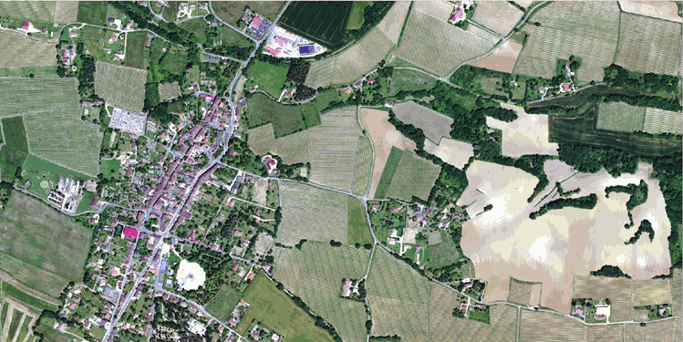
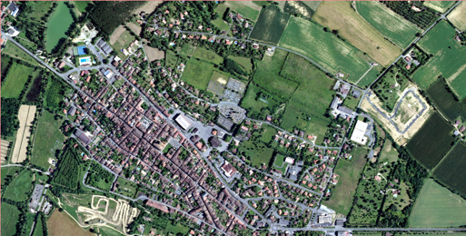

# Bienvenue sur la page des datasets FLAIR de l'IGN

<a style="font-size: 11pt" href="./index.html"><b>English version</b></a>

 

L'Institut national de l'information géographique et forestière (IGN) présente ses défis en matière d'IA et ses jeux de données de référence FLAIR (pour French Land Cover from Aerospace ImageRy). [En savoir plus sur le contexte de ces défis.](./pourquoi_flair.html)  
Contactez-nous à l'adresse: <a href = "mailto:ai-challenge@ign.fr?subject=FLAIR - AI challenge @IGN">ai-challenge@ign.fr</a>

  

## FLAIR #1 : segmentation sémantique et adaptation de domaine 🌍🌱🏠🌳➡️🛩️

Challenge organisé par l'IGN avec le soutient de la <a href="https://www.sfpt.fr/"><b>SFPT.</b></a>
Ce challenge s'est déroulé du 21 Novembre 2022 au 21 Mars 2023. Vous pouvez consulter les résultats <a style="font-size: 10pt" href="https://codalab.lisn.upsaclay.fr/competitions/8769"><b>ici.</b></a>   

FLAIR #1 <b> datapaper  &#128209;</b>  : https://arxiv.org/pdf/2211.12979.pdf  
FLAIR #1 <b> dépôt github &#128193;</b> : https://github.com/IGNF/FLAIR-1-AI-Challenge   

### Description

Avec des données acquises sur 50 départements et plus de 20 milliards de pixels annotés, ce jeu de données représente la diversité du territoire métropolitain, ses climats, ses écosystèmes et ses sols, dans le but de produire une cartographie à grande échelle. Différentes bases de données IGN (BD Ortho, RGE Alti) ainsi que des annotations produites manuellement par des experts photo-interprètes ont été assemblées pour permettre l’entraînement de modèles IA.

Les images aériennes de télédétection à l'échelle d'un pays sont nécessairement acquises à des dates et des heures différentes et dans des conditions différentes. De même, à grande échelle, les caractéristiques des classes sémantiques peuvent varier et devenir hétérogènes. Cela soulève des challenges pour la généralisation spatiale et temporelle des modèles d'apprentissage profond !

Le dataset FLAIR#1 est composé de 77,412 patches de 512x512 (résolution spatiale de 0.2m) avec une sémantique à 19 classes. Spécifiquement pour le challenge et les baselines associées et en raison d'une fréquence par classe déséquilibrée, la sémantique a été modifiée à 13 classes (>12 -> 13). Rapportez-vous au datapaper pour plus de précisions. 

<table style="width:60%">
<thead>
  <tr><th width=20%></th><th>Classe</th><th width=15%>Valeur</th><th>Freq.-entraînement (%)</th><th>Freq.-test (%)</th></tr>
</thead>
<tbody>
  <tr><td bgcolor='#db0e9a'></td><td>bâtiment</td><td style='text-align: center'>1</td><td style='text-align: center'>8.14</td><td style='text-align: center'>8.6</td></tr>
  
  <tr><td bgcolor='#938e7b'></td><td>zone perméable</td><td style='text-align: center'>2</td><td style='text-align: center'>8.25</td><td style='text-align: center'>7.34</td></tr>
  
  <tr><td bgcolor='#f80c00'></td><td>zone imperméable</td><td style='text-align: center'>3</td><td style='text-align: center'>13.72</td><td style='text-align: center'>14.98</td></tr>
  
  <tr><td bgcolor='#a97101'></td><td>sol nu</td><td style='text-align: center'>4</td><td style='text-align: center'>3.47</td><td style='text-align: center'>4.36</td></tr>
  
  <tr><td bgcolor='#1553ae'></td><td>eau</td><td style='text-align: center'>5</td><td style='text-align: center'>4.88</td><td style='text-align: center'>5.98</td></tr>
  
  <tr><td bgcolor='#194a26'></td><td>conifères</td><td style='text-align: center'>6</td><td style='text-align: center'>2.74</td><td style='text-align: center'>2.39</td></tr>
  
  <tr><td bgcolor='#46e483'></td><td>feuillus</td><td style='text-align: center'>7</td><td style='text-align: center'>15.38</td><td style='text-align: center'>13.91</td></tr>
  
  <tr><td bgcolor='#f3a60d'></td><td>brousaille</td><td style='text-align: center'>8</td><td style='text-align: center'>6.95</td><td style='text-align: center'>6.91</td></tr>
  
  <tr><td bgcolor='#660082'></td><td>vigne</td><td style='text-align: center'>9</td><td style='text-align: center'>3.13</td><td style='text-align: center'>3.87</td></tr>
  
  <tr><td bgcolor='#55ff00'></td><td>pelouse</td><td style='text-align: center'>10</td><td style='text-align: center'>17.84</td><td style='text-align: center'>22.17</td></tr>
  
  <tr><td bgcolor='#fff30d'></td><td>culture</td><td style='text-align: center'>11</td><td style='text-align: center'>10.98</td><td style='text-align: center'>6.95</td></tr>
  
  <tr><td bgcolor='#e4df7c'></td><td>terre labourée</td><td style='text-align: center'>12</td><td style='text-align: center'>3.88</td><td style='text-align: center'>2.25</td></tr>
  
  <tr><td bgcolor='#3de6eb'></td><td>piscine</td><td style='text-align: center'>13</td><td style='text-align: center'>0.03</td><td style='text-align: center'>0.04</td></tr>
  
  <tr><td bgcolor='#ffffff'></td><td>neige</td><td style='text-align: center'>14</td><td style='text-align: center'>0.15</td><td style='text-align: center'>-</td></tr>
  
  <tr><td bgcolor='#8ab3a0'></td><td>coupe</td><td style='text-align: center'>15</td><td style='text-align: center'>0.15</td><td style='text-align: center'>0.01</td></tr>
  
  <tr><td bgcolor='#6b714f'></td><td>mixte</td><td style='text-align: center'>16</td><td style='text-align: center'>0.05</td><td style='text-align: center'>-</td></tr>
  
  <tr><td bgcolor='#c5dc42'></td><td>ligneux</td><td style='text-align: center'>17</td><td style='text-align: center'>0.01</td><td style='text-align: center'>0.03</td></tr>
  
  <tr><td bgcolor='#9999ff'></td><td>serres</td><td style='text-align: center'>18</td><td style='text-align: center'>0.12</td><td style='text-align: center'>0.2</td></tr>
  
  <tr><td bgcolor='#000000'></td><td>autre</td><td style='text-align: center'>19</td><td style='text-align: center'>0.14</td><td style='text-align: center'>-</td></tr>
</tbody>
</table>

Le dataset couvre un total d'environ 800 km², avec des patches sélectionnés sur l'ensemble du territoire métropolitain afin de représenter sa diversité (domaines spatiaux). Les images aériennes incluent dans le dataset sont également acquisent à des mois et années différentes (domaines temporels). 

<table>
    <tr>
        <td style="text-align: center"></td>
        <td style="text-align: center"></td>
    </tr>
    <tr>
        <td style="text-align: center">Image aérienne ORTHO HR&#174;</td>
        <td style="text-align: center">Annotations</td>
    </tr>
</table>

Le dataset de test contient 15,700 patches de 10 domaines spatiaux supplémentaires. La fréquence des classes et les domaines temporels sont également distinct du dataset d'entraînement, permettant d'analyser les capacités de généralisation et d'adaptation de domaines des méthodes développées.  

### Baseline model

Une architecture U-Net avec un encodeur ResNet34 pré-entraîné de la librairie segmentation-models-pytorch a été utilisée pour les baselines. L'architecture utilisée permet l'intégration d'informations de métadonnées à l'échelle du patch et utilise des techniques d'augmentation des données d'image couramment utilisées. Les codes sont disponibles dans le dépôt FLAIR #1.  

### Datasets

<table>
  <tr>
    <th>Données</th>
    <th>Volume</th>
    <th>Type</th>
    <th>Lien</th>
  </tr>
  <tr><td colspan="4" height = 10px></td>
  <tr>
    <td>Images aériennes - entraînement</td>
    <td>50.7 Go</td>
    <td>.zip</td>
    <td><a style="font-size: 10pt" href="https://storage.gra.cloud.ovh.net/v1/AUTH_366279ce616242ebb14161b7991a8461/defi-ia/flair_data_1/flair_aerial_train.zip"><b>download</b></a>
  </tr>
  <tr>
    <td>Images aériennes - test</td>
    <td>13.4 Go</td>
    <td>.zip</td>
    <td><a style="font-size: 10pt" href="https://storage.gra.cloud.ovh.net/v1/AUTH_366279ce616242ebb14161b7991a8461/defi-ia/flair_data_1/flair_1_aerial_test.zip"><b>download</b></a>
  </tr>
  <tr>
    <td>Annotations - entraînement</td>
    <td>485 Mo</td>
    <td>.zip</td>
    <td><a style="font-size: 10pt" href="https://storage.gra.cloud.ovh.net/v1/AUTH_366279ce616242ebb14161b7991a8461/defi-ia/flair_data_1/flair_labels_train.zip"><b>download</b></a>
  </tr>
  <tr>
    <td>Annotations - test</td>
    <td>124 Mo</td>
    <td>.zip</td>
    <td><a style="font-size: 10pt" href="https://storage.gra.cloud.ovh.net/v1/AUTH_366279ce616242ebb14161b7991a8461/defi-ia/flair_data_1/flair_1_labels_test.zip"><b>download</b></a>
  </tr>
  <tr><td colspan="4" height = 10px></td>
  <tr>
    <td>Métadonnées aériennes</td>
    <td>16.1 Mo</td>
    <td>.json</td>
    <td><a style="font-size: 10pt" href="https://storage.gra.cloud.ovh.net/v1/AUTH_366279ce616242ebb14161b7991a8461/defi-ia/flair_data_1/flair-1_metadata_aerial.zip"><b>download</b></a>
  </tr>
  <tr>
    <td>Shapefile zones</td>
    <td>392 Ko</td>
    <td>.gpkg</td>
    <td><a style="font-size: 10pt" href="https://storage.gra.cloud.ovh.net/v1/AUTH_366279ce616242ebb14161b7991a8461/defi-ia/flair_data_1/flair_1_shapes.gpkg"><b>download</b></a>
  </tr>
  <tr><td colspan="4" height = 10px></td>
  <tr>
    <td>Jeu de données exemple (entraînement et test réduits)</td>
    <td>215 Mo</td>
    <td>.zip</td>
    <td><a style="font-size: 10pt" href="https://storage.gra.cloud.ovh.net/v1/AUTH_366279ce616242ebb14161b7991a8461/defi-ia/flair_data_1/flair_1_toy_dataset.zip"><b>download</b></a>
  </tr>
</table>
  

  

## FLAIR #2 : Texture et temps à partir d'imagerie optique multimodal pour la segmentation sémantique 🌍🌱🏠🌳➡️🛩️🛰️ 

Challenge organisé par l'IGN avec le soutient du <a href="https://cnes.fr/en"><b>CNES.</b></a>

 
<b>Prochainement !</b> 

<!---
FLAIR #2 repository : https://github.com/IGNF/FLAIR-2-AI-Challenge
-->

